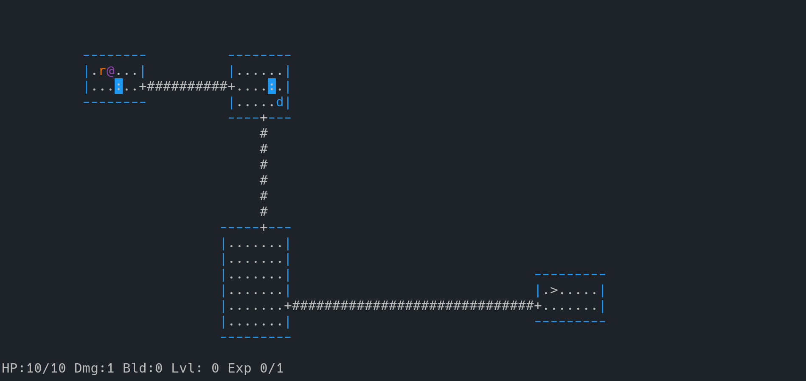
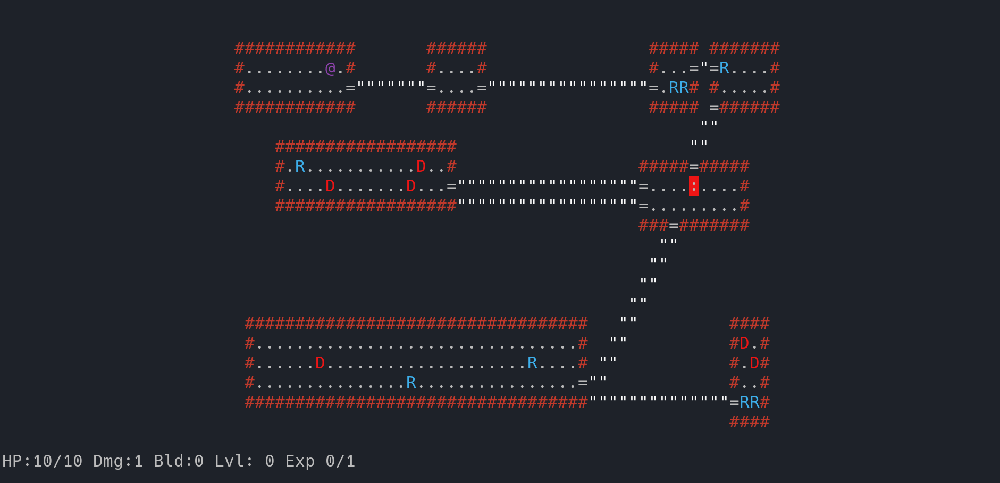

rogue-like game
===============

*Working only on Unix-like systems*

##





## Build

``` bash
cd src
make
./rogue
```

## Commands

| Command | Key |
|---|---|
| Movement  | hjkl, HJKL |
| Inventory | i, * |
| Drop      | d |
| Wield     | w |
| Wear      | W |
| Quaff     | q |
| Go next   | > |

## Symbols

| Symbol | Meaning |
|---|---|
| @ | playable character |
| B | beast, unfriendly npc |
| : | loot |
| # | wall |
| + | door |
| " | path |
| > | thing that move to next level |
| < | thing you came from |
