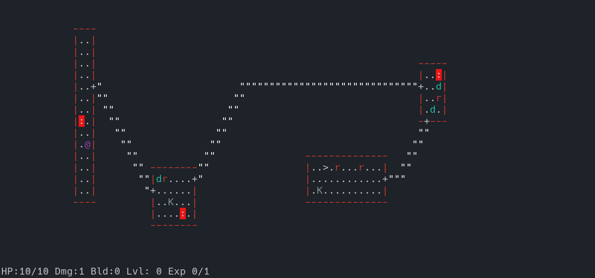
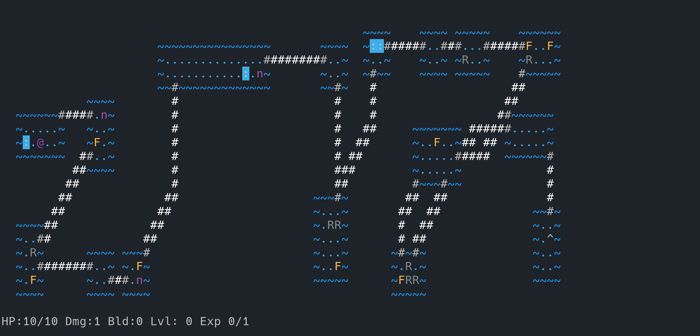

rogue-like game
===============

## Levels






## Commands

| Command | Key |
|---|---|
| Movement  | hjkl, HJKL |
| Inventory | i, * |
| Drop      | d |
| Wield     | w |
| Wear      | W |
| Quaff     | q |
| Go next   | > |

## Symbols

| Symbol | Meaning |
|---|---|
| @ | playable character |
| B | beast, unfriendly npc |
| : | loot |
| # | wall |
| + | door |
| " | path |
| > | thing that move to next level |
| < | thing you came from |

## Dependencies
* C compiler
* make
* ncurses

## Build

### Linux

``` bash
git https://github.com/17seannnn/rogue
cd rogue/src
make
./rogue
```

### Windows

Same as Linux, but you have to use msys64
``` bash
pacman -S gcc make ncurses-devel git
git https://github.com/17seannnn/rogue
cd rogue/src
make
./rogue
```
